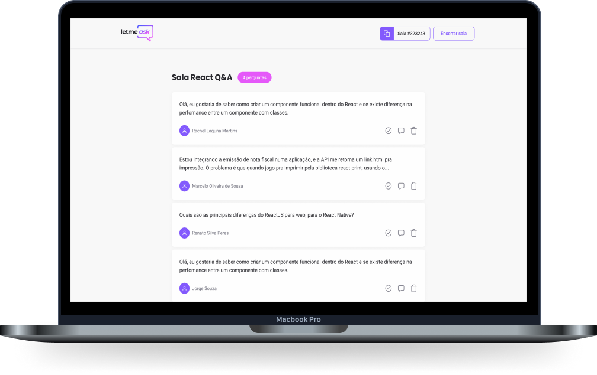

<!-- Logotipo -->
<div align="center">
  
</div>

<!-- Logo -->
<h1 align="center"> Let me ask </h1>
<!-- Sobre o Projeto -->

## 🧐 Sobre o Projeto

O LetMeAsk é uma plataforma de perguntas e respostas dedicada a criadores de conteúdo que são bombardeados com perguntas em suas transmissões. O LetMeAsk permite que a comunidade vote nas perguntas mais relevantes, bem como permite que o administrador da sala destaque e apague perguntas, tudo em tempo real.

## 🔥 Preview

Acesse o link: https://letmeask-9810a.firebaseapp.com/

## 🚀 Tecnologias e Bibliotecas

- [ReactJS](https://reactjs.org/)
- [Typescript](https://www.typescriptlang.org/)
- [SASS](https://sass-lang.com/)
- [Firebase](https://firebase.google.com/)

## 💻 Rodando o Projeto

```bash
# Realize o Clone deste repositório
$ https://github.com/lucasbarque/LetMeAsk.git
# ou use a opção de download.
# Acesse a pasta do projeto
$ cd LetMeAsk
# Instale as dependências
$ yarn install
ou
$ npm install
# Executando o Projeto
$ yarn dev
ou
$ npm run dev
# Acesse http://localhost:3000 no seu navagador
```
